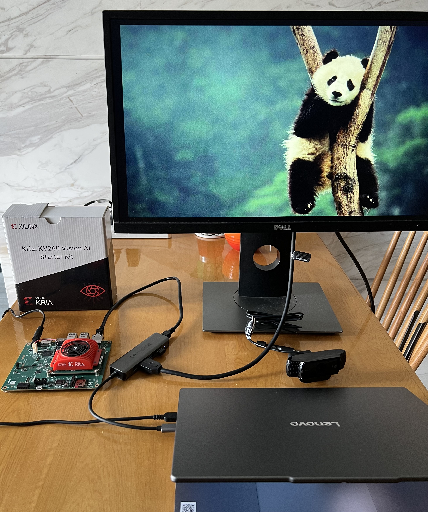
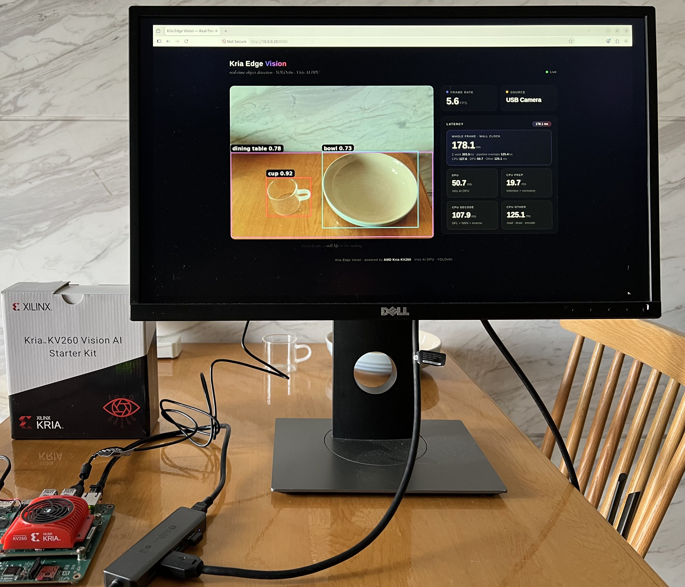

# Kria Edge Vision

**Real-time object detection on the AMD Kria KV260 — a fully quantized YOLOv8n running end-to-end on the on-board DPU, with a live web dashboard.**

This project takes a live USB camera feed (or a bundled COCO demo gallery), runs YOLOv8n **entirely on the KV260's dedicated AI processor (DPU)**, and serves a polished real-time dashboard: an MJPEG live stream with per-box class + confidence overlays, and live metrics (frame rate, DPU latency, detection count).

It is not a "run the canned demo" project. The whole model — backbone, neck, and Detect-head convolutions — was hand-ported into the Vitis AI DPU through post-training quantization. The parts the DPU cannot execute (DFL decode + NMS) were implemented from scratch in pure numpy on the board's ARM CPU.

---

## Highlights

- **Full-model DPU deployment** — backbone + neck + Detect-head 1x1 convs all run on the KV260 DPU (B4096); only DFL softmax decode and per-class NMS run on the ARM CPU (pure numpy, no OpenCV).
- **Post-training quantization** (pytorch_nndct 3.5) calibrated on **COCO-128**, covering all 80 COCO classes including the person / cup / bottle / chair / table the cafe/bar demo uses.
- **3-output xmodel trick** — the Detect head is patched to return the 3 raw `(1,144,80/40/20)` head tensors, making them leaf nodes. The exported model has exactly 3 outputs, cleanly sidestepping the NNDCT multi-output serialization bug.
- **SiLU → hard-swish** converted at quantization time (the DPU has no native SiLU).
- **Live dashboard** — MJPEG stream with per-box overlays + FPS / DPU latency (ms) / detection count, Apple-inspired dark glass UI; input auto-switches between USB camera and demo gallery.
- **Runs headless** as a `systemd` service with auto-restart; simple manual start script also included.

## Tech Stack

| Layer | Technology |
|---|---|
| SoM | AMD Kria KV260 (Zynq UltraScale+ MPSoC, 4x Cortex-A53, DPU B4096) |
| Model | YOLOv8n (ultralytics) → post-training quantization (pytorch_nndct 3.5) |
| Inference runtime | Vitis AI Runtime 3.5.0 (VART) with `libxcl_stub.so` XRT workaround |
| Decode | Pure numpy: DFL softmax(16) + per-class NMS + letterbox inverse |
| Backend | Python 3.10, Flask 3.1.3 |
| Frontend | HTML/CSS/JS, MJPEG streaming, Apple-design dark UI |
| Service | systemd (`dpu-load.service` + `kv260-vision.service`) |

## System Architecture

```
USB camera ──┐                        ┌── /video_feed  (MJPEG stream)
             ├─► letterbox 640×640    │
Demo image ──┘        │               │
                      ▼               │
            ┌───────────────────┐     │
            │  KV260 DPU (B4096)│     │
            │  quantized YOLOv8n│     │
            │  backbone+neck+   │     │
            │  Detect head convs│     │
            └─────────┬─────────┘     │
                      │ 3 raw head    │
                      │ (1,144,80)    │
                      │ (1,144,40)    │
                      │ (1,144,20)    │
                      ▼               │
            ┌───────────────────┐     │
            │ ARM CPU (numpy)   │     │
            │ DFL decode + NMS  │     │
            │ letterbox inverse │     │
            └─────────┬─────────┘     │
                      ▼               │
            PIL overlay (English     │
            COCO labels, Apple-      │
            minimal boxes) ──────────┴──► /api/status (JSON metrics)
```

Pipeline: **Input (USB camera / demo frame) → letterbox to 640x640 → DPU inference → 3 raw head tensors → CPU numpy DFL decode + per-class NMS → PIL overlay → MJPEG stream + JSON metrics.**

## Repository Layout

```
kria-edge-vision/
├── YoloV8DetectExport.xmodel   #   final 3-output model deployed on the board
├── kv260-vision.service        #   systemd unit (auto-start + auto-restart, waits for DPU)
├── dpu-load.service            #   systemd oneshot: loads DPU B4096 bitstream at boot
├── board/                      # board-side assets
│   ├── board_infer.py          #   standalone DPU inference test (CLI)
│   ├── board_dets.json         #   sample raw detections (dev)
│   ├── yolo_decode.py          #   numpy DFL decode + NMS (shared with web/)
│   └── overlay/                #   DPU B4096 firmware (AMD Kria AI benchmark)
│       └── benchmark-b4096.bit / .xclbin / pl.dtbo / pl.dtsi / shell.json
├── workspace/                  # host-side build (quantize + compile)
│   ├── quantize_yolov8n_full.py#   full-model PTQ (backbone+neck+head convs)
│   ├── yolo_decode.py          #   numpy decode reference (dev/verification)
│   ├── decode_check.py         #   decode-vs-pytorch verification
│   ├── quantize_full_resume.py #   resume an interrupted quantization run
│   ├── xcl_stub.c              #   XRT stub source (compiled to libxcl_stub.so)
│   ├── arch_kv260_fp_only.json #   DPUCZDX8G_ISA1_B4096 compile arch (INT8 only)
│   ├── arch_kv260_fp16.json    #   DPUCZDX8G_ISA1_B4096 compile arch (fp16 capable)
│   ├── quantize_result_full/   #   exported 3-output wrapper + PTQ artifacts (xmodel git-ignored)
│   └── start_dev.sh            #   optional dev container loop
├── web/                        # deployable web application (copied to board)
│   ├── app.py                  #   Flask: page, MJPEG, status JSON, source switch
│   ├── infer.py                #   DPU inference via VART (letterbox + 3 outputs)
│   ├── camera.py               #   input source: USB camera auto-detect / demo
│   ├── draw.py                 #   PIL overlay: Apple-minimal boxes, EN labels
│   ├── yolo_decode.py          #   numpy DFL decode + NMS + letterbox inverse
│   ├── demo_imgs/              #   COCO demo frames (fallback when no camera)
│   ├── templates/index.html    #   dashboard UI (Apple-design dark theme)
│   └── start_web.sh            #   manual start script
├── steps.md                    #   full build log (quantize → deploy → web)
└── LICENSE                     #   MIT license
```

## How It Works

### 1. Quantization (host)

`workspace/quantize_yolov8n_full.py` runs inside the Vitis AI 3.5 Docker container (pytorch_nndct, CPU):

- Loads the ultralytics YOLOv8n and patches the Detect head `forward` to return only the 3 raw concatenated `(reg + cls)` head tensors — no DFL, no NMS.
- Quantizes the whole graph (backbone + neck + Detect-head convs) with post-training quantization, converting SiLU to hard-swish (`nndct_convert_silu_to_hswish`).
- Calibrates on an auto-downloaded COCO-128 subset (all 80 classes).
- Exports `quantize_result_full/YoloV8DetectExport_int.xmodel` — verified to have exactly **3 outputs**.

### 2. Compile (host)

The quantized model is compiled with the Vitis AI Compiler targeting **DPUCZDX8G_ISA1_B4096** (see `arch_kv260_fp_only.json`), producing the final 3-output xmodel shipped as `YoloV8DetectExport.xmodel`.

### 3. Runtime (board)

- Vitis AI Runtime 3.5.0 (VART) loads the xmodel on the DPU; `LD_PRELOAD=/usr/local/lib/libxcl_stub.so` provides the XRT stub so VART runs without full XRT.
- `web/infer.py` letterboxes each frame to 640x640, runs inference, and feeds the 3 raw head tensors into `web/yolo_decode.py` — a pure-numpy DFL softmax(16) per anchor, per-class NMS, and letterbox inverse mapping.
- `web/draw.py` renders English COCO labels with Apple-minimal thin boxes via PIL.
- `web/app.py` serves the stream and metrics; `web/camera.py` auto-selects the USB camera or falls back to the demo gallery.

## Getting Started

### Prerequisites

- **Host (quantize/compile):** Vitis AI 3.5 Docker image (pytorch_nndct 3.5, torch, ultralytics, OpenCV).
- **Board:** AMD Kria KV260 running Ubuntu 22.04 (Python 3.10), Vitis AI Runtime 3.5.0 installed, `libxcl_stub.so` at `/usr/local/lib/libxcl_stub.so`.

### 1. Quantize + compile (host)

```bash
# inside the Vitis AI 3.5 container, with workspace mounted at /workspace
cd /workspace
python quantize_yolov8n_full.py          # -> quantize_result_full/YoloV8DetectExport_int.xmodel
# compile with the Vitis AI Compiler (DPUCZDX8G_ISA1_B4096, arch_kv260_fp_only.json)
# -> compiled_full_v3/deploy.xmodel (3 outputs); rename to YoloV8DetectExport.xmodel
```

### 2. Deploy to the board

```bash
BOARD=ubuntu@<board-ip>
scp YoloV8DetectExport.xmodel $BOARD:~/kv260/yolov8-dpu/
scp -r web $BOARD:~/kv260/yolov8-dpu/
```

Ensure the runtime and stub are in place:

```bash
# on the board
sudo dnf install vitis-ai-runtime-3.5.0-*.rpm    # Vitis AI Runtime 3.5.0 (AMD)
sudo cp xcl_stub.so /usr/local/lib/libxcl_stub.so
```

The DPU firmware overlay ships in `board/overlay/Benchmark-B4096-Firmwares/` (AMD Kria AI benchmark B4096). Load it so the DPU is present in the programmable logic — e.g. with `xmutil` or the FPGA manager — then confirm the DPU shows up before starting the service.

### 3. Run the application

**Option A — systemd (recommended):** two units are used. `dpu-load.service` is a one-shot that loads the DPU B4096 bitstream into the programmable logic at boot (the FPGA resets to the starter-kit shell after a power cycle, so the DPU would be missing otherwise and the vision service would crash with `Check failed: !get_factory_methods().empty()`); `kv260-vision.service` declares `Requires=`/`After=` on it so inference only starts once the DPU is present:

```ini
# dpu-load.service
[Unit]
Description=Load DPU B4096 bitstream into PL
After=dfx-mgr.service
Before=kv260-vision.service

[Service]
Type=oneshot
ExecStart=/bin/sh -c 'xmutil unloadapp >/dev/null 2>&1; xmutil loadapp benchmark-b4096'

[Install]
WantedBy=multi-user.target
```

```ini
# kv260-vision.service
[Unit]
Description=KV260 YOLOv8n Vision Web Service (Kria Edge Vision)
After=network.target dpu-load.service
Requires=dpu-load.service

[Service]
Type=simple
Environment=LD_PRELOAD=/usr/local/lib/libxcl_stub.so
WorkingDirectory=/home/ubuntu/kv260/yolov8-dpu/web
ExecStart=/usr/bin/python3 /home/ubuntu/kv260/yolov8-dpu/web/app.py --port 8080
Restart=always
RestartSec=3
User=ubuntu

[Install]
WantedBy=multi-user.target
```

```bash
sudo cp dpu-load.service kv260-vision.service /etc/systemd/system/
sudo systemctl daemon-reload
sudo systemctl enable --now dpu-load kv260-vision
sudo systemctl status kv260-vision
```

**Option B — manual:**

```bash
cd ~/kv260/yolov8-dpu/web && ./start_web.sh
```

Then open **http://<board-ip>:8080** in a browser.

## Web UI & API

| Endpoint | Method | Description |
|---|---|---|
| `/` | GET | Dashboard page (live MJPEG stream + metrics) |
| `/video_feed` | GET | MJPEG stream (frame-by-frame, detection overlay) |
| `/api/status` | GET | JSON: `fps`, `dpu_ms`, `det_count`, `detections[]` (class, score, bbox), `source` |
| `/api/source` | POST | Switch input source (`auto` / `cam` / `demo`) |

The dashboard shows the live stream with per-box class + confidence overlays and the latency/throughput metrics; full per-detection data (class, score, bbox) is available in real time via `/api/status`.

## Performance — Stage 1 measured baseline (2026-08-16)

All numbers measured on the board: KV260 (DPU B4096 firmware), 640×640 INT8 input, USB camera source, web service under continuous inference. Frame rate, DPU latency and per-stage timing are also streamed live on the dashboard via `/api/status`. See `steps.md` (steps 20–21) for the full measured run log.

| Metric | Value | Notes |
|---|---|---|
| Pipeline throughput | **~5.8–5.9 FPS** | 3-stage multithreaded pipeline (capture → detect → draw/encode); single-thread baseline was 4.3 FPS (+37%) |
| Wall-clock frame period | ~169–173 ms | `1000/FPS`; pipeline stages overlap, so period < per-frame work |
| Per-frame work (end-to-end) | ~285 ms | Σ of stage EMAs: read ~74 + letterbox ~17 + DPU ~50 + decode 103–106 + draw ~26 + encode ~12 |
| DPU inference (640×640) | **~50 ms** | YOLOv8n backbone+neck+head convs on DPU B4096 (INT8) |
| CPU decode (DFL + NMS) | ~103–106 ms | pure numpy; the current critical path and the Stage-2 HLS target |
| SoC temperature | **~42 °C under load** | Zynq UltraScale+ AMS system monitor (`hwmon0/ams`, 42/42/40 °C); active PWM fan (`hwmon1/pwmfan`) |
| System load | ~1.5 / 4× A53 | `loadavg` 1.56 / 1.49 / 1.39 during camera inference |

## Demo Media

Captured on the real hardware (2026-08-16). Photos and the demo video live in `media/` and render inline on GitHub:





## Roadmap

**Stage 1 — complete (current):** full-model DPU inference with a pure-numpy CPU decode path. The pipeline is real-time and works end-to-end on the board: USB camera → letterbox → DPU → DFL decode + NMS → web dashboard.

**Stage 2 — planned optimization:** move the non-DPU pipeline stages off the ARM CPU into custom accelerators on the KV260 programmable logic, written in Vitis HLS:

- **Letterbox / preprocessing** (resize + padding + normalization) as a streaming pre-processor.
- **DFL softmax-16 decode** as a dedicated accelerator.
- **Per-class NMS** — the most challenging stage (data-dependent loop bounds; typically a streaming sort/select accelerator).

Goal: keep the DPU + PL as the complete inference engine so the ARM CPU drops out of the per-frame critical path, raising end-to-end throughput and lowering latency. The Stage-1 baseline (FPS, per-stage latency, DPU time, SoC temperature) is recorded in the Performance section and will be re-measured after Stage 2 for a direct before/after comparison.

## Troubleshooting

- **First request from the host occasionally times out** — intermittent board network behavior; retry, the service itself is stable (`systemctl is-active kv260-vision`).
- **`libxcl_stub.so` missing / VART errors** — the stub must be preloaded (`LD_PRELOAD`) for VART to work without full XRT.
- **UI changes not showing** — restart the service after editing `templates/index.html`; there is no cache layer.
- **No camera** — the app automatically falls back to `web/demo_imgs/` (COCO demo frames); metrics and detection work identically.

## See Also

- `steps.md` — the complete build log: environment setup, quantization runs, DPU compile, board bring-up, and web development history.
- `LICENSE` — MIT license; free to use and modify with attribution.
